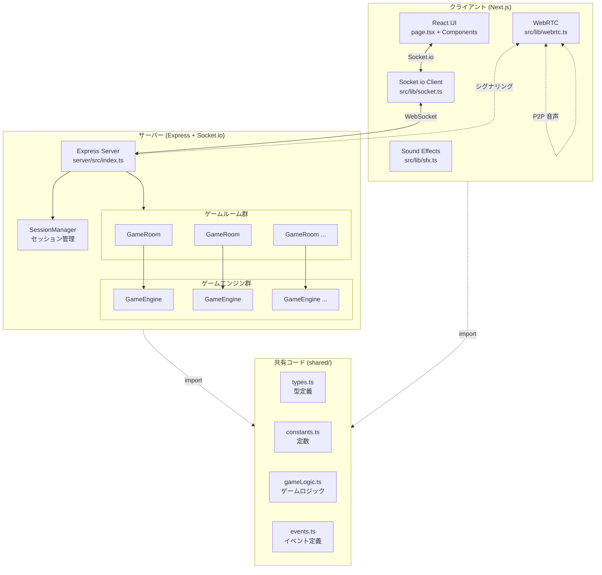
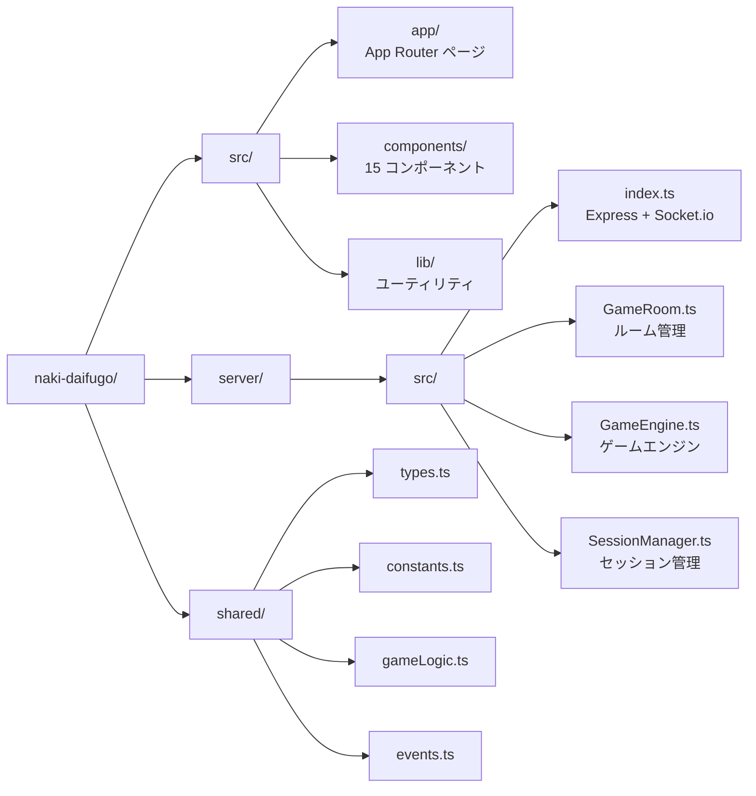
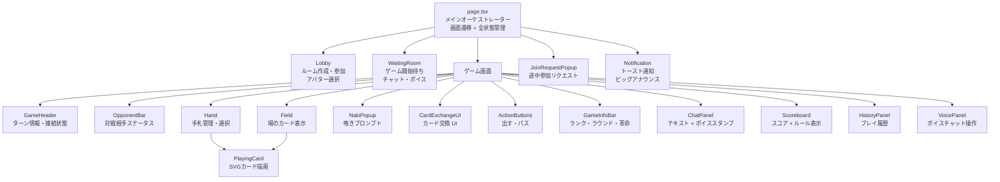
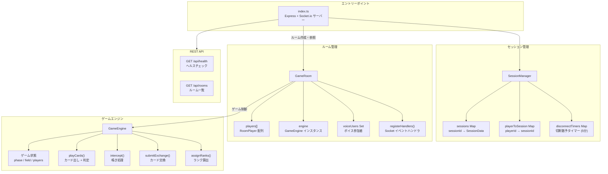
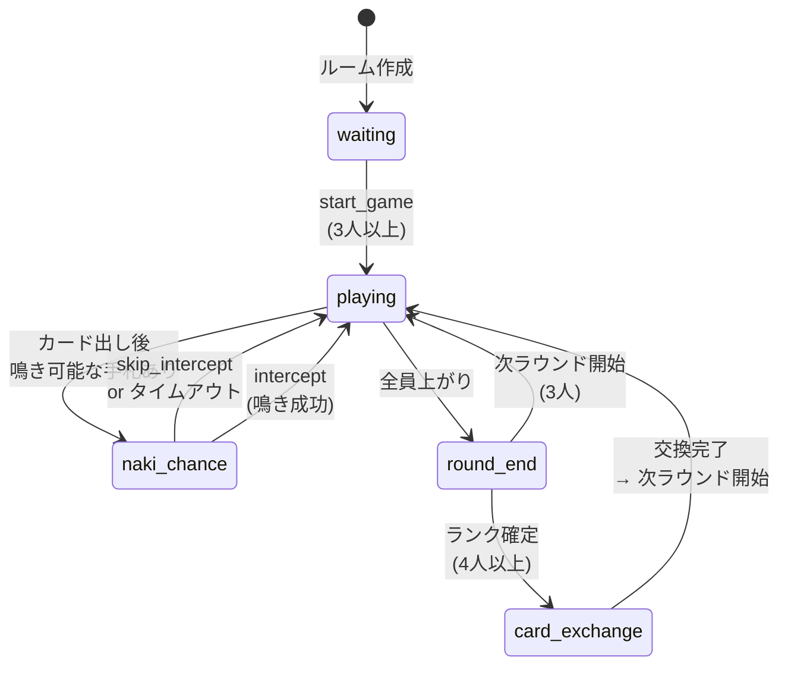
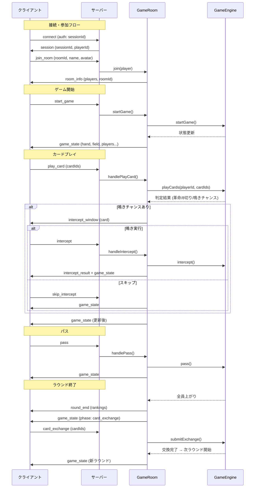
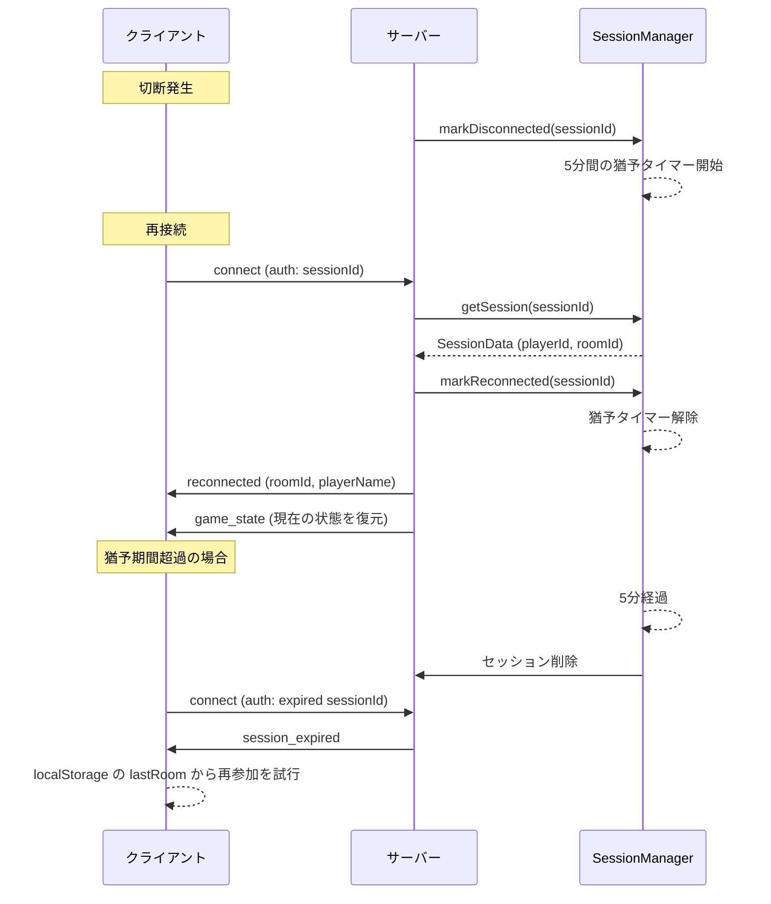
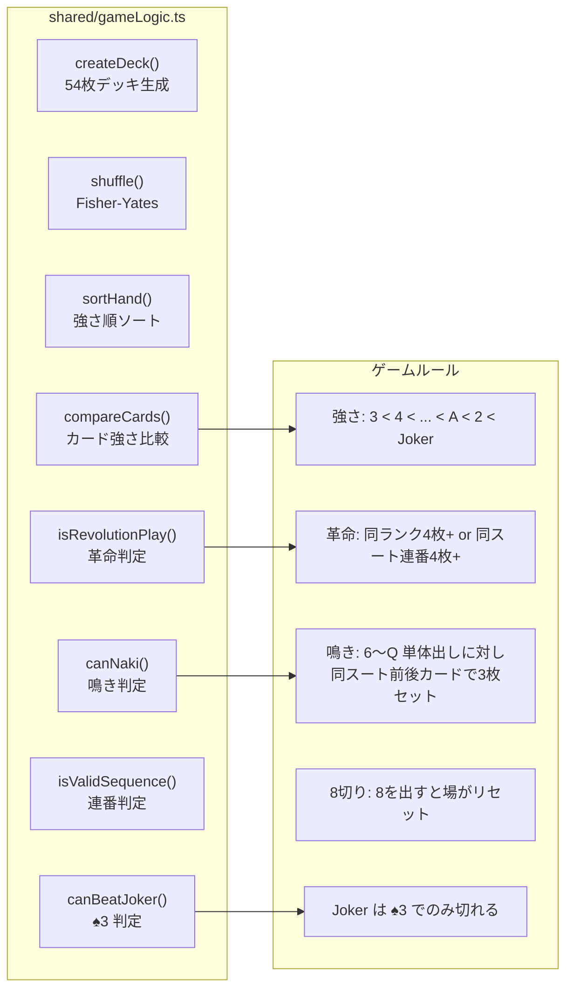
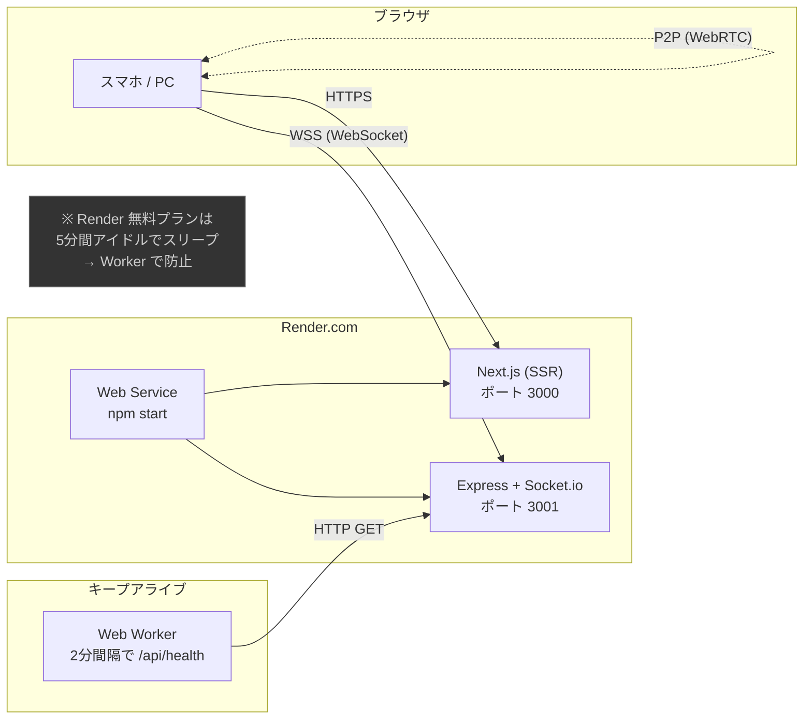

# 鳴き大富豪 - アーキテクチャドキュメント

## 技術スタック

| レイヤー | 技術 |
|---|---|
| フロントエンド | Next.js 16 (App Router) + React 19 + TypeScript |
| スタイリング | Tailwind CSS 4 |
| バックエンド | Node.js + Express + TypeScript |
| リアルタイム通信 | Socket.io 4 |
| ボイスチャット | WebRTC (P2P) + Socket.io シグナリング |
| カード描画 | @letele/playing-cards (SVG) |
| サウンド | Web Audio API |
| ホスティング | Render.com |

---

## システム全体構成



---

## ディレクトリ構成



---

## フロントエンド コンポーネント階層



---

## バックエンド モジュール構成



---

## ゲームフェーズ遷移（状態マシン）



---

## Socket.io イベントフロー



---

## 再接続フロー



---

## ボイスチャット (WebRTC) フロー

```mermaid
sequenceDiagram
    participant A as プレイヤーA
    participant S as サーバー (シグナリング)
    participant B as プレイヤーB

    A->>S: voice_join
    S->>A: voice_users (既存参加者リスト)
    S->>B: voice_user_joined (A)

    Note over A,B: WebRTC ハンドシェイク
    A->>A: RTCPeerConnection 作成
    A->>A: getUserMedia (音声取得)
    A->>S: voice_signal (offer SDP)
    S->>B: voice_signal (offer SDP)
    B->>B: RTCPeerConnection 作成
    B->>B: getUserMedia (音声取得)
    B->>S: voice_signal (answer SDP)
    S->>A: voice_signal (answer SDP)

    Note over A,B: ICE Candidate 交換
    A->>S: voice_signal (ICE candidate)
    S->>B: voice_signal (ICE candidate)
    B->>S: voice_signal (ICE candidate)
    S->>A: voice_signal (ICE candidate)

    Note over A,B: P2P 音声ストリーム確立
    A<-->B: 音声データ (P2P)
```

---

## データフロー

```mermaid
graph TD
    subgraph Frontend["フロントエンド状態"]
        PageState["page.tsx useState<br/>hand[] / field[] / players[]<br/>selected Set / screen / chatOpen"]
        SessionStorage["sessionStorage<br/>sessionId (タブ固有)"]
        LocalStorage["localStorage<br/>lastRoom (ブラウザ共有)"]
    end

    subgraph Backend["バックエンド状態 (インメモリ)"]
        RoomMap["rooms Map<br/>roomId → GameRoom"]
        SessionMap["sessions Map<br/>sessionId → SessionData"]
        EngineState["GameEngine 状態<br/>players[] / field[] / phase<br/>isRevolution / round"]
    end

    EngineState -->|"broadcastGameState()"| PageState
    PageState -->|"play_card / pass / intercept"| EngineState

    SessionStorage <-->|"接続時 auth"| SessionMap
    LocalStorage -->|"再接続時 roomId"| RoomMap

    style Frontend fill:#1a3a2a,stroke:#4ade80
    style Backend fill:#1a2a3a,stroke:#60a5fa
```



### 永続化について

現在のアーキテクチャでは**データベースを使用しておらず**、すべての状態はサーバーメモリ上に保持されます。
サーバー再起動時にはゲーム状態が失われますが、クライアント側の `sessionStorage` / `localStorage` を活用した再接続機構により、一時的な切断には対応しています。

---

## ゲームロジック（共有コード）



---

## デプロイ構成



---

## 主要な設計判断

| 項目 | 決定 | 理由 |
|---|---|---|
| 状態管理 | useState (page.tsx 集中管理) | ゲーム状態はサーバーが正とするため、クライアントは薄く保つ |
| DB | なし (インメモリ) | リアルタイムゲームの特性上、永続化より低レイテンシを優先 |
| 共有コード | shared/ ディレクトリ | フロント・バック間のロジック重複を排除 |
| ボイスチャット | WebRTC P2P | サーバー負荷を避け、低レイテンシ音声通信を実現 |
| 再接続 | sessionStorage + 5分猶予 | モバイルブラウザのバックグラウンド移行に対応 |
| カード描画 | SVG (@letele/playing-cards) | 高解像度対応 + 軽量 |
| サウンド | Web Audio API (動的生成) | 音声ファイル不要で軽量 |
